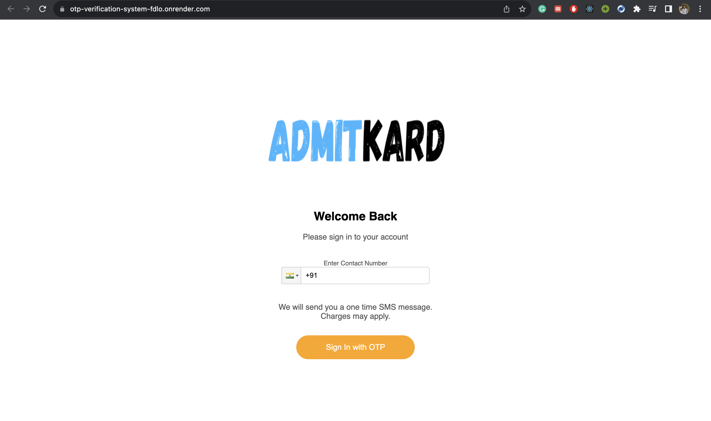
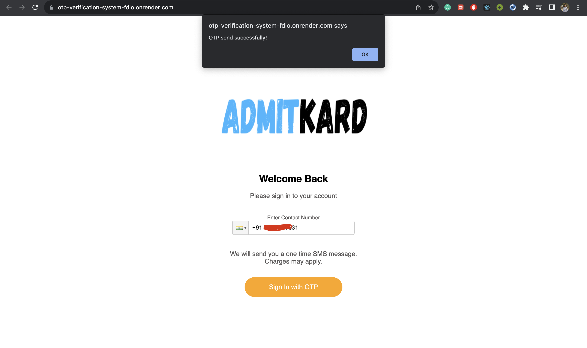
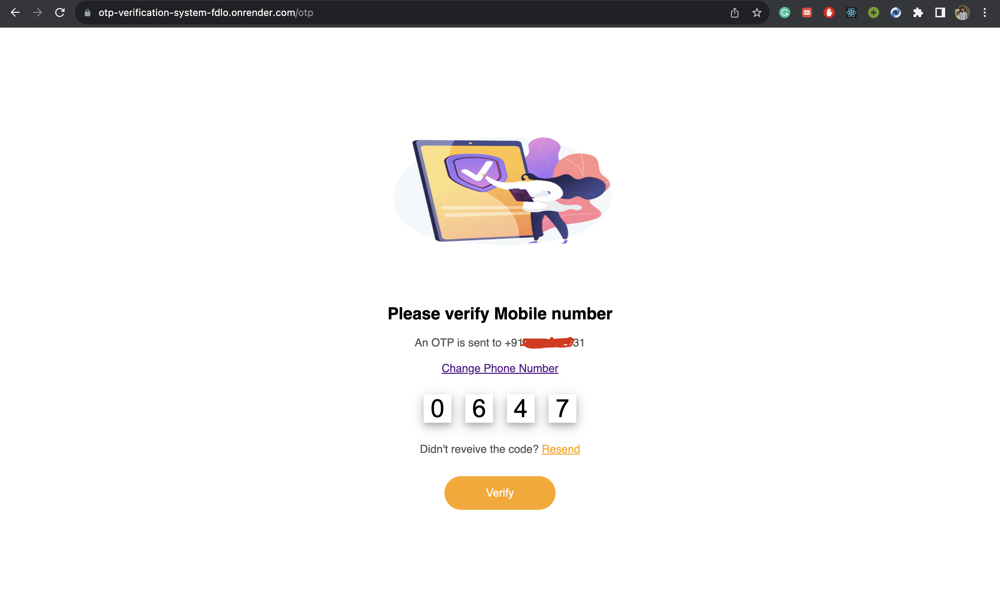
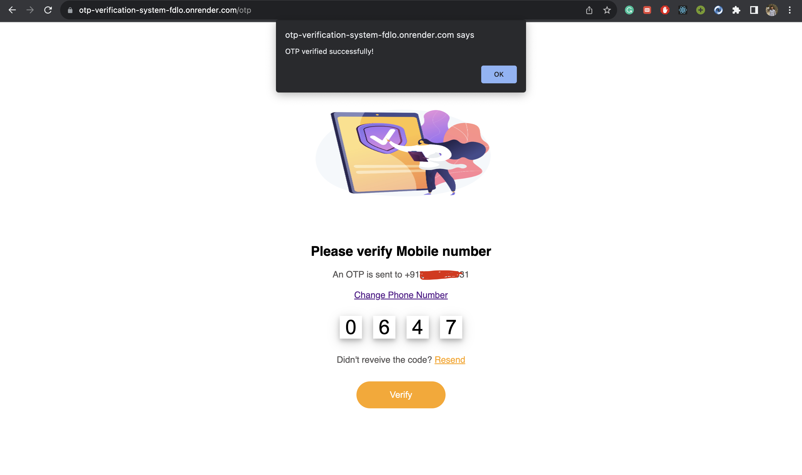
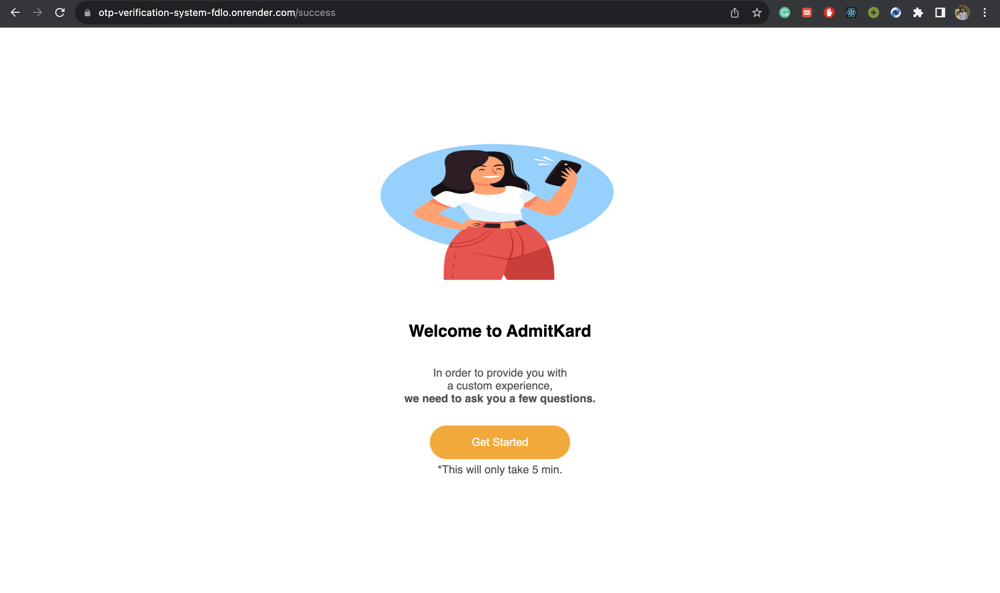

# OTP Verification System
This is the application where users get verified using OTP send to their phone number. You can visit the site by clicking [here](https://otp-verification-system-fdlo.onrender.com/). The backend API can be accessed using this [link](https://otp-verification-system-api.onrender.com/).  
You can watch this [video]() to understand how the whole application works.
## Working of Application
Let's understand how to use the application.  
**Step 1 :**
Visit the homepage of the [website](https://otp-verification-system-fdlo.onrender.com/).
The homepage will look like this. 

**Step 2 :**
Enter your contact number in the contact field.
You have an option to choose different country code.  
In the below example, I am using default country code (+91) and entering my number to send OTP to my mobile by clicking **Sign In with OTP** button.

**Step 3 :**
After entering and clicking on the **Sign In with OTP** button you will get an alert that the OTP has be sent successfully to your mobile number.

**Step 4 :**
Now click on the *OK* shown in the alert box and you will be redirected to OTP verification page. Put the OTP received on your mobile number in the Boxes. There are other options present like *Resend* to resend the OTP again on same number, and *Change Phone Number* to change the phone number.

**Step 5 :**
After entering the OTP, click on the **Verify** button and you will get an alert that OTP has been verified successfully.

**Step 6 :**
Now click on the *OK* shown in the alert box and you will be redirected to success page. That's it you are now verified successfully and can use our services.

## Tech Stacks and Services Used
- For Frontend, *React* is used to create beautiful UI and components.
- For Backend, we have used *Node.js, Express*.
- For OTP SMS service, we have used *Twilio's* API which is intergrated with *Node.js and Express*.
- Both, backend and frontend is hosted using free cloud hosting platform *Render*.

## Conclusion
Hope you love this application. Made with love by *Rajat Agrawal*.  
Happy Coding!

